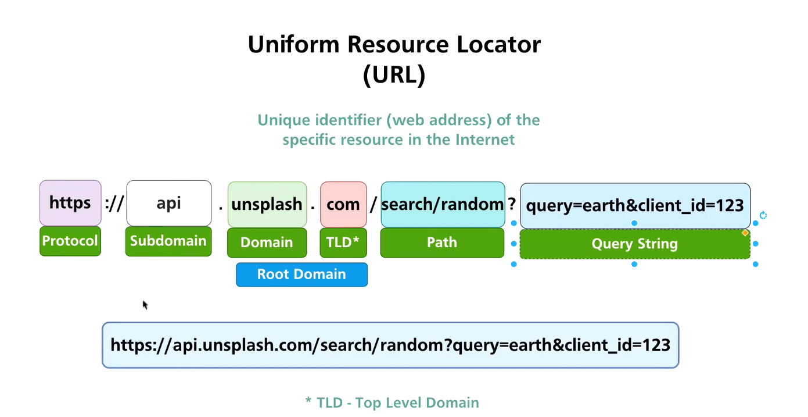

### Personal training & learning Full Stack

- Course: Full Stack Web Development Bootcamp with React and Python
- Author: Bogdan Stashchuk
- Provider: O'Reilly Learning
- [Course Link](https://learning.oreilly.com/api/v1/continue/9781801811040/)

### Check required installations

```
$ node --version
v22.1.0

$ npm --version
10.7.0

$ npx --version
10.7.0
```

### Install React.JS and create project

```
$ npm create vite@latest
$ cp frontend
$ npm install
$ npm run dev
```

### VSCode extentions used:
 - Material Icon Theme
 - ESLint
 - Markdown Preview Enhanced
 - Peacock

###  VSCode formatting through the following shortcuts:

- On Windows Shift + Alt + F
- On Mac Shift + Option + F
- On Linux Ctrl + Shift + I

### As I am not following the course exactly had to update dependencies in package.json

FROM:

```
  "dependencies": {
    "react": "^18.2.0",
    "react-dom": "^18.2.0",
  },
```

INCLUDE:

```
  "dependencies": {
    "react": "^18.2.0",
    "react-dom": "^18.2.0",
    "react-scripts": "^5.0.0"
  },
```

### In Lesson 6.2 "Creating Header Component" I've intalled

```
$ npm install react-bootstrap@1.4.0 bootstrap@4.5.3
$ npm audit fix --force
```

### In Lesson 6.3 "What are React Props" worth further investigation

NOTE: Controlled component is when we control the input with help of state before pressing the button.

```
Now summarize what we did in App.js and Search.js files. So first of all, we used the useState hook in order to define initial value of the variable word, and word is part of the state of this component. Also there is function setWord that we could utilize in order to update value of this variable word. Next we've passed word and setWord as properties to Search component. And also we've defined here inside of App component handleSearchSubmit function that will actually perform some actions, when we press Search button it will send fetch API request, and now this function has access to this word variable. And again this function is passed the same as word and setWord as property to Search component. Inside of Search component using destructuring we retrieve those three variables out of properties, and afterwards here inside of Form we added onSubmit property, and anytime when button is clicked this handleSubmit function will be called. Also inside of this Form.Control we've used word and setWord properties value of this form is connected to state of App component, and it shows actually value of the word variable. And whenever you change this input we call this function, this function, and we update with help of setWord value of the word variable inside of App component. You could quickly try to comment out this line, save changes, and see whether now you will be able to enter something in the form or not. Let's go back to web browser and try to enter something here. I am typing right now but nothing appears here because now we don't update state of application and that's why word here remains unchanged, and that's why we don't see any changes here in this input field. Let's go back to Control component like that and now we could of course make changes here. Let's go back to App.js, and remove this console.log statement and let's keep this console.log statement here for a while. Now we have access to word, search word that is entered by user, and now we could use this word in order to send fetch API request. And next let's create API key that we could utilize in order to send requests to Unsplash API. But before doing that, let's quickly commit changes here, and here, let's type commit message, controlled search component. Let's commit changes, changes were committed and now we are ready to proceed.
```

### Chapter 7 : Making Unsplash API Requests

### Chapter 7 : Adding Local File with Environment Variables

- In the course using native REACT uses the following details

```
file --> .env.local = REACT_APP_UNSPLASH_KEY=xxxx
App.js = const UNSPLASH_KEY = process.env.REACT_APP_UNSPLASH_KEY
App.js = console.log(process.env);
```

- In Vite React use the following details

```
file --> .env = VITE_APP_UNSPLASH_KEY=xxxx
App.js = const UNSPLASH_KEY = import.meta.env.VITE_APP_UNSPLASH_KEY
App.js = console.log(import.meta.env);
```



### Chapter 7 : Making First API Request for Random Photo

### Chapter 7 : Analyzing API Requests and Responses

### VisualStudio Code - Prettier - Code formatter Extention description

- Prettier - Code formatter  
  -Will format all your code within the given file to a development standard  
  -Spaces, semi-colons, remove blank lines, paragraphs, single and double quotes, etc

### Chapter 8 : Configure ESLint Validation
Edit .vscode/settings.json
Add following lines after installing ESLint extention this will automatically show errors in VSCode 
```
    "eslint.validate": [
        "html",
        "javascript",
        "javascriptreact"]
```
### Chapter 8 : Installing and Enabling Prettier ESLint Plugin
```
$ npm install -D prettier eslint-config-prettier eslint-plugin-prettier
```