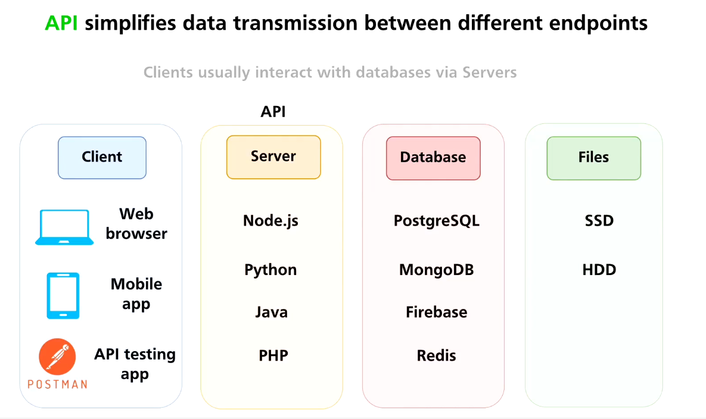
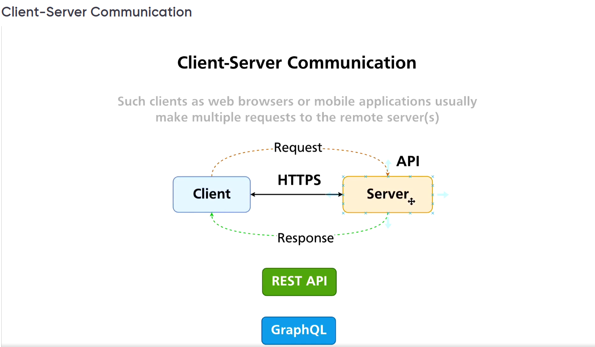
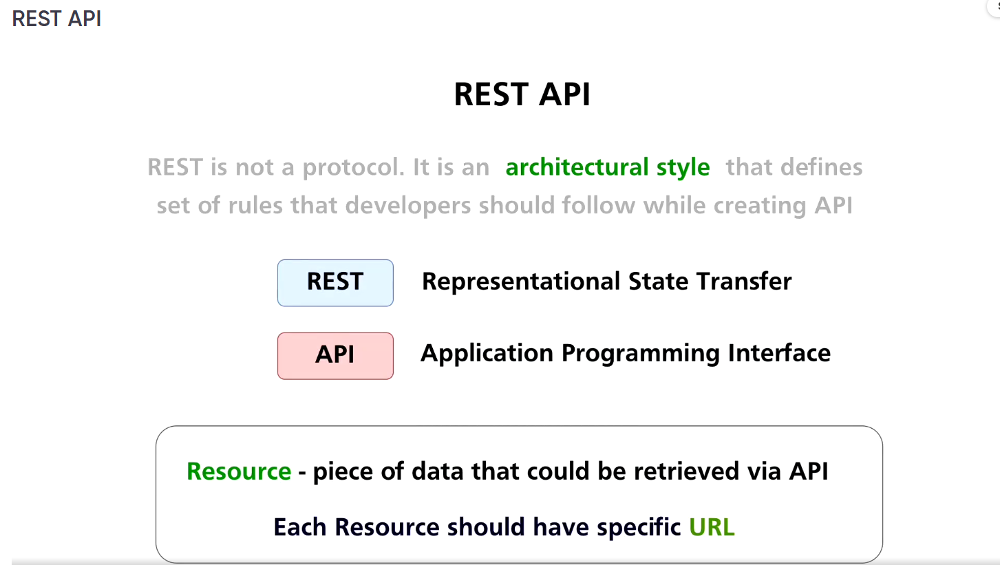

### Quick overview on API

### API Simplified

[Intro Music] So far, we built our frontend application, and it talks directly to Unsplash API, and before starting development of our own API service using Python Flask, let me take some time and explain you API

concepts in greater details. Before, I didn't want to spend much time on that, because I wanted to create the first version of application as fast as possible. But now it's a very good time to make a paise in our development process, and talk about such concepts as REST API, request- response, REST API methods,

idempotent methods, and so on. And let me start with explanation which problems API actually helps us to solve. Let's have a look at this diagram. Here, you might see Client, Server, Database, and Files. And usually clients such as web

browsers, mobile applications, or other applications, need to retrieve some data from the database. And database might contain, for example, user profiles, user tweets, images, video files, and so on. And of course, all those files are located

on some hard drives, or SSD drives. And database talks to file system in order to retrieve those files. And of course, databases may contain billions of different records, billions of user profiles, and images. And specific client for

example, mobile application on your mobile phone needs only a small piece of data that is located in this database. For example, when you log into LinkedIn, your mobile application retrieves user profile from the database. And certainly, such clients as web browsers, or

mobile applications could talk to database directly. But for that every single client needs to have credentials to access a specific database. And certainly, that is not secure. And of course, different databases have different methods of communications. There

are such databases, for example as PostgreSQL, MongoDB, Firebase, or Redis. And again, each specific database requires a specific client in order to talk to this database. And definitely it is not convenient to implement such clients in web browsers or mobile

applications, it is overhead. And that's why it makes sense to place some servers between clients and databases, and make those servers talk the same language with all clients. And, of course, server runs

specific application that listens to requests from clients, and talks then to database. And you could use a variety of different programming languages to create such applications on servers, for example, Node.js, Python, Java, PHP, and so on. And now this

bridge, let's say between client and database simplifies this communication between clients and database, it makes it much more easier. And usually most common protocol that is used between client and server is HTTPS, or HTTP. HTTPS is a secure version of

HTTP protocol that works over TLS. And HTTP is actually standard. And if such a standard protocol is implemented on the server, it does not matter which underlying technology is used here to create this server application. Any client

either web browser, or mobile application, or for example, Postman, that is API testing application, we will actually utilize this app in this course, are able very easily talk using HTTP or HTTPS protocol with the server.

And now independent of the client that is running on a specific computer, like a laptop or desktop computer on different operating systems, on mobile phones with different operating systems are capable, very easy, get access to specific resources or get behind API application servers. And notice

that there might be different databases behind specific server. And different pieces of data may be retrieved from different databases. Like for example, user profiles could be retrieved from PostgreSQL; some real time data like

user ucommunication in real time might be stored and retrieved from a Redis Database and so on. And this communication between server and databases is transparent for clients. To summarize, API on the servers simplifies data transmission between different endpoints. And specific files could

be easily retrieved by clients via API on the servers. Alright, let's next continue this discussion and talk in greater details about communication between clients and servers. I'll see you guys next.

### API CLient & Server Comms

[Intro Music] We've just discussed purpose of the API. And now you know that API actually simplifies data transmission between different endpoints, like between clients and databases. And now let's talk about communication between clients and servers. Clients and servers

communicate with help of requests and responses. Client sends a request for a specific resource to the server, and server responds back with a response. For example, client could request particular image from the server, or client

could request a particular user profile for specific user that is logged in, in the web browser, or client might request a specific video file, or client might request changes of the user profile at the server, and server might perform this

change and respond whether this change was successful or not. That's communication between client and server. And in most cases, this communication happens using HTTPS protocol. Recap that HTTPS is secure version of HTTP. And if a specific server does not

use HTTPS, and it uses HTTP instead, then I don't recommend you to communicate with such server, and interrupt connection as fast as possible. Because HTTP transfers all data unencrypted. HTTPS on other side establishes secure connection using TLS protocol, and

afterwards transmits all data via this secure tunnel. And all data that is transferred via HTTPS is encrypted. Also notice that when you load for example, any web page, client might send to the server multiple requests for different

resources. For example, one of the request is used in order to retrieve HTML webpage from the server, another request is used to get CSS file from the server, and many other requests might be used in order to retrieve some images or some video files, some

JSON objects from the server, and so on. And also for a single web page client might make requests to different servers to get different pieces of the web page. Also, notice that for every request, client establishes new HTTPS connection. But in HTTP

version 2, it is possible to combine multiple requests in a single HTTPS connection and retrieve multiple resources from the same server. That's how communication between client and server happens. There are requests and there are responses from the

server. That's it. And also, when client has already retrieved the necessary data from the server or servers, then there is no need to keep HTTPS connection up. And now there is actually no connection between client and server. You might ask me, why I've added the REST API and GraphQL blocks here

on this diagram. Let me explain you. Clients and servers usually need to perform some actions with resources that they work with. For example, client needs to have ability to retrieve resources from the server, to get them, to read them from the server. Also, client needs

to have ability to create new resources, for example, create a new user profile, or upload a new image to the server and so on. Also, client needs to have ability to update particular resources on the server. For example, update user photo in the user profile, or for example, update job title in the

user profile, and so on. And also clients need to have ability to delete specific resources from the server. For example, if client doesn't want to have his profile on the server anymore, it might request server to delete such user profile. And with help of a REST API or GraphQL, clients are able to

perform all those actions on the servers. REST API is architectural style. And we will talk about REST API in details later on. And we will actually utilize REST API in this course when we will build our own API. GraphQL is a query

language, and with help of queries client could perform all sorts of managing actions. All right, next after a small pause let's talk in details about

### REST API

[Intro Music] REST API is most popular method of communication between clients and servers. And actually both REST API and the GraphQL in most cases work over HTTPS. REST is not a protocol. It is an architectural style. And

this style defines actually a set of rules that developers should follow while creating API. REST stands for Representational State Transfer. And API stands for Application Programming Interface. And basically, with help of REST API,

you could transfer state of specific resources from the server to client, or from the client to server. Resource is a piece of data that could be retrieved, or updated or deleted via API. And one of the rules in REST API architectural

style is that each resource should have a specific URL. URL stands for Uniform Resource Locator. And with example of user profiles, every specific user profile should have separate unique URL. And usually User ID is

included in such URLs in order to make them unique. Also, there might be another resource that is actually list of multiple user profiles. In such case, such a list will have its own specific URL. That's one of the main rules in

REST API. And again, to summarize, REST API is just architectural style. It's set of rules, a set of guidelines that you should follow when you want to create your RESTful API. All right, let's next have a look at the example of the URL. See you guys after the pause.